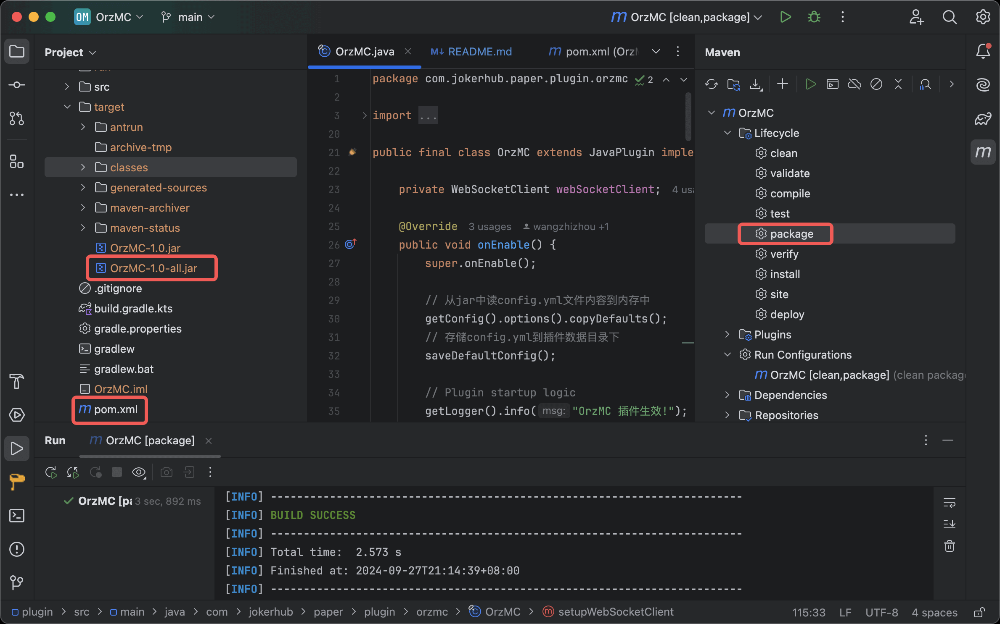
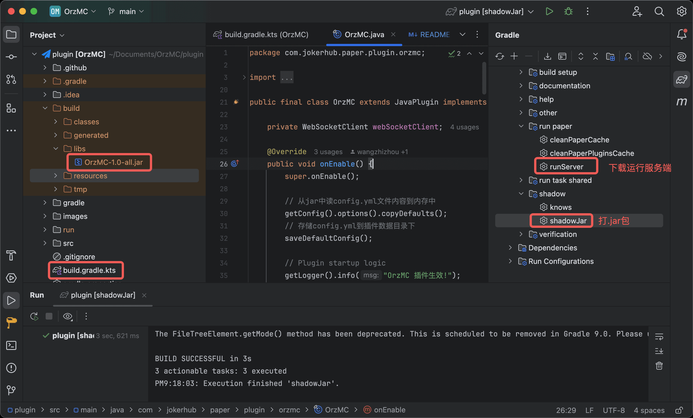

# OrzMCPlugin
[](https://hangar.papermc.io/wangzhizhou666/OrzMC)
[](https://hangar.papermc.io/wangzhizhou666/OrzMC)
[](https://hangar.papermc.io/wangzhizhou666/OrzMC)

[](https://hangar.papermc.io/wangzhizhou666/OrzMC)

[私服](https://minecraft.jokerhub.cn)开服自研插件，用来辅助管理员运维。

本插件针对[PaperMC](https://papermc.io/)服务器进行开发，由于`PaperAPI`兼容`BukkitAPI`和`SpigotAPI`，

所以插件开发对有 Bukkit 和 Spigot 插件开发经验的开发者也比较友好。

---

## 插件配置文件：config.yml
```yaml
# 服务器是否开启强制白名单
force_whitelist: true
# 服务器爆炸事件监听
explosion_report: false
# Discord 频道链接，用于提示玩家加入Discord讨论群
discord_link: 'https://discord.gg/MnKfFQ58rD'

# QQ机器人群消息发送服务配置

# 是否启用 QQBot 机器人功能：true/false
enable_qq_bot: false
# QQBot 所在QQ群号：group_id
qq_group_id: '<QQ玩家群号>'
# QQBot 所在QQ群管理员帐号
qq_admin_id: '<QQ群里服务器管理员对应的QQ号>'
# QQBot 机器人 HTTP/HTTPS 服务端地址，OneBot 11协议
qq_bot_api_server: 'http://127.0.0.1:3000'
# QQBot 机器人 WebSocket 服务端地址
qq_bot_ws_server: 'ws://127.0.0.1:3001'

# Discord 频道机器人开关
enable_discord_bot: false
# Discord 频道机器人 api 授权: discord_bot_token_base64_encoded = base64_encode(discord_bot_token)
# Create Token follow Link: https://discord.com/developers/applications
# Use Shell Command to Generate this value: `echo -n "discord_token_value" | base64`
discord_bot_token_base64_encoded: '<不带空格和回车的Discord机器人Token值进行base64加密后的值>'
# Discord 玩家文字频道，用来发送服务端上下线通知的频道
# 获取方法，设置 -> 高级设置 -> 开发者模式 打开，长按对应文字频道，在弹出的菜单中选择最后一项：复制频道ID
discord_player_text_channel_id: '<Discord文字频道，需要拉入上面配置的机器人做为成员>'

# Lark飞书群机器人开关
enable_lark_bot: false
# Lark飞书群机器人webhook地址，插件 -> lark群 单方向发消息
lark_bot_webhook: '<飞书群自定义机器人的webhook地址>'
```

## 插件提供的能力

### 1. 服务器开启强制白名单

PaperMC 服务器添加此插件后，会自动开启强制白名单模式，不在白名单中的玩家无法进入服务器

### 2. QQ群内管理服务器

配置 QQ 机器人(搭配 [NapCatQQ](https://github.com/NapNeko/NapCatQQ) 服务)，可以在QQ群里通过命令添加/移除白名单玩家

```
👨‍💼 管理员命令：
/a	添加玩家到服务器白名单中
/r	从服务器白名单中移除玩家
👨🏻‍💻 通用命令: 
/l	查看当前在线玩家
/w	查看当前在白名单中的玩家
/h	查看QQ群中可以使用的命令信息
```

### 3. Discord频道服务器管理

配置 Discord 机器人，可以在 Discord 文字频道把机器人拉入后管理服务器玩家，命令与 QQ 机器人一致

### 4. 飞书群机器人通知

飞书群自定义机器人，由于只能通过调用 webhook 向群里发消息，飞书群只能接收消息，无法发命令到MC服务器，
所以目前只能用来同步服务器状态，不能主动管理玩家进出白名单。

### 5. 提供玩家指令

#### `/tpbow` 玩家进入服务器后，可通过此命令随时获取一把传送弓。

> 使用传送弓射箭，玩家会瞬移到箭落地的位置。如果箭掉落水里或岩浆里，玩家不会瞬移。

#### `/guide` 玩家首次进入服务器后，会获得一本玩家指南，如果后面丢掉了，可以通过此命令重新获取

---
## 插件使用

- 首次使用插件
  1. 下载本插件后，直接放到 PaperMC 服务器插件目录 `plugins/` 下，启动服务端后，本插件的数据目录就会出现
  2. 修改插件数据目录下的`config.yml`配置文件，重启服务

- 更新插件：
  1. PaperMC 插件目录下提供一个名称 `update/`的目录，把要更新的插件文件放到这个目录下面
  2. 下次服务端重启时，插件会被自动移到`plugins/`目录下面，完成插件升级

## 问题反馈

- 如果你在使用过程中发现问题，欢迎给项目提建议：[issues](https://github.com/OrzGeeker/OrzMCPlugin/issues)

- 也可以进入飞书问题或需求反馈群：

    

---
## 开发

本插件构建支持 maven 或 gradle，具体使用什么方式构建可以根据自己的喜好进行选择

支持命令行方式构建，也支持使用IDE开发，推荐使用
**[IntelliJ IDEA Community Edition](https://www.jetbrains.com/idea/download)** + 
**[Minecraft Development插件](https://plugins.jetbrains.com/plugin/8327-minecraft-development)** 
进行插件开发

> 以下假设你在MacOS上进行插件开发

### 使用 maven 构建

命令行构建，需安装 maven 工具链: `brew install maven`，执行以下命令进行打包：

```bash
$ mvn clean package
```

使用 IntelliJ IDEA CE(社区免费版) 构建：



### 使用 Gradle 构建

命令行构建，需安装 gradle 工具链： `brew install gradle`，执行以下命令进行打包：

```bash
$ gradle clean shadowJar
```

命令行本地直接调试，自动下载服务端并启动运行插件：

```bash
$ gradle runServer
```

使用 IntelliJ IDEA CE(社区免费版) 构建和运行插件，可以打断点调试，参考文档
[README.md](https://github.com/jpenilla/run-task#basic-usage)
和 [Wiki](https://github.com/jpenilla/run-task/wiki)



## 相关链接

- [PaperAPI文档](https://papermc.io/javadocs)

- [SpigotAPI文档](https://hub.spigotmc.org/javadocs/spigot/)

- [Bukkit Wiki](https://bukkit.fandom.com/wiki/Main_Page)

- [TextComponent](https://docs.adventure.kyori.net/text.html#creating-components)
